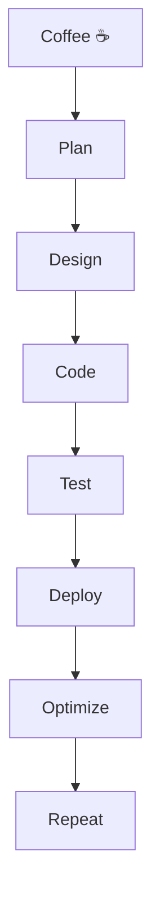
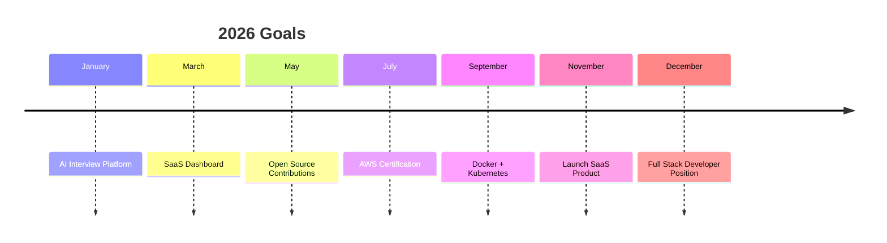
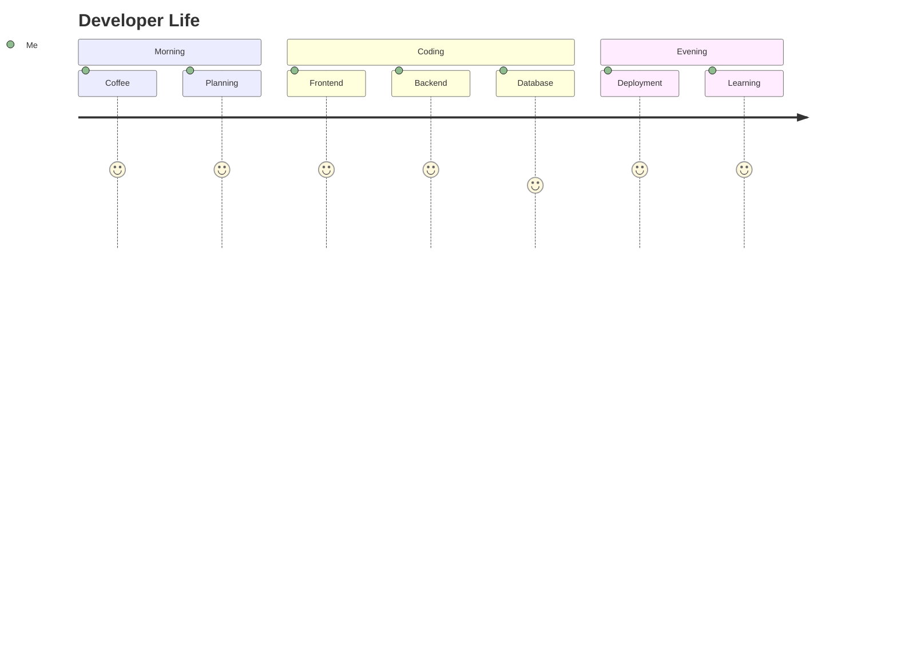

<!-- ========================================================= -->
<!--                    PREMIUM GITHUB PROFILE                 -->
<!-- ========================================================= -->

<p align="center">

</p>

<p align="center">


</p>

---

<p align="center">

<a href="https://github.com/Sumitrathod16">

</a>

<a href="https://github.com/Sumitrathod16">

</a>


</p>

---

# 💫 Welcome


### 👋 Hey there!

I'm **Sumit Rathod**, a passionate **Full Stack Developer** from India who loves creating high-performance web applications and AI-powered solutions.

I enjoy transforming ideas into polished digital products with modern UI/UX and scalable backend architecture.

Whether it's a startup landing page, SaaS dashboard, AI platform, or business website, I focus on delivering clean code, intuitive design, and exceptional user experiences.

---

## ⚡ Quick Snapshot

```yaml
Name: Sumit Rathod

Role:
  - Full Stack Developer
  - UI/UX Designer
  - Freelancer
  - Founder

Company:
  Inspire Web & App Solutions

Location:
  India 🇮🇳

Languages:
  JavaScript
  TypeScript
  Java
  Python

Frontend:
  React
  Next.js
  HTML5
  CSS3
  Tailwind CSS

Backend:
  Node.js
  Express.js
  REST APIs

Database:
  MongoDB
  MySQL
  Firebase

Currently Working On:
  AI Interview Platform
  SaaS Dashboard
  Client Websites

Learning:
  AWS
  Docker
  Kubernetes
  System Design

Hobbies:
  Coding
  UI Design
  Coffee ☕
  Tech Research

Motto:
  "Build products that solve real problems."
```

---

# 👨‍💻 Developer Card

```javascript
class Developer {

    constructor() {

        this.name = "Sumit Rathod";

        this.role = "Full Stack Developer";

        this.company = "Inspire Web & App Solutions";

        this.location = "India";

        this.skills = [
            "React",
            "Next.js",
            "Node.js",
            "Express",
            "MongoDB",
            "MySQL",
            "Firebase",
            "Tailwind CSS"
        ];

        this.currentProjects = [
            "AI Interview Platform",
            "Business Websites",
            "SaaS Applications",
            "Portfolio Systems"
        ];

        this.learning = [
            "AWS",
            "Docker",
            "Kubernetes",
            "System Design"
        ];

    }

    sayHello() {

        return "Welcome to my GitHub Profile 🚀";

    }

}

const me = new Developer();

console.log(me.sayHello());
```

---

# 🌍 Connect With Me

<p align="center">

<a href="https://github.com/Sumitrathod16">

</a>

<a href="https://linkedin.com/in/YOUR-LINKEDIN">

</a>

<a href="mailto:sr8705589@gmail.com">

</a>

<a href="https://instagram.com/sumit_rtd7">

</a>

</p>

---

<p align="center">


</p>
<!-- ========================================================= -->
<!--                 TECH STACK & ANALYTICS                    -->
<!-- ========================================================= -->

# 🚀 Tech Arsenal

<p align="center">


</p>

---

# 💻 Development Ecosystem

<table align="center">

<tr>

<td align="center" width="220">

### 🎨 Frontend

HTML5

CSS3

JavaScript

TypeScript

React.js

Next.js

Tailwind CSS

Bootstrap

Redux

</td>

<td align="center" width="220">

### ⚙️ Backend

Node.js

Express.js

REST APIs

Authentication

JWT

Firebase

API Integration

MVC Architecture

</td>

<td align="center" width="220">

### 🗄 Database

MongoDB

MySQL

Firebase

Database Design

CRUD Operations

Aggregation

</td>

</tr>

<tr>

<td align="center">

### ☁ Deployment

Vercel

Netlify

GitHub Pages

Render

Railway

</td>

<td align="center">

### 🛠 Tools

Git

GitHub

VS Code

Postman

Figma

Canva

</td>

<td align="center">

### 📚 Learning

Docker

AWS

Kubernetes

System Design

CI/CD

Linux

</td>

</tr>

</table>

---

# 📈 Coding Journey

```text

Frontend Development
███████████████████████░░░ 95%

React Development
█████████████████████░░░░░ 90%

Backend Development
████████████████████░░░░░░ 85%

Node.js
████████████████████░░░░░░ 85%

MongoDB
███████████████████░░░░░░░ 80%

MySQL
███████████████████░░░░░░░ 80%

UI / UX
█████████████████████░░░░░ 90%

Problem Solving
████████████████████░░░░░░ 85%

```

---

# 🎯 Current Focus

<div align="center">

| 🚀 Working On | 📖 Learning | 🎯 Goal |
|--------------|------------|----------|
| AI Interview Platform | Docker | Full Stack Engineer |
| SaaS Dashboard | AWS | Open Source |
| Business Websites | Kubernetes | Product Builder |
| Client Projects | System Design | Startup Founder |

</div>

---

# ⚡ Daily Workflow



---

# 📊 GitHub Analytics

<p align="center">


</p>

---

# 🔥 GitHub Streak

<p align="center">


</p>

---

# 📈 Contribution Graph

<p align="center">


</p>

---

# 🏆 GitHub Trophies

<p align="center">


</p>

---

# 📉 Detailed GitHub Stats

<p align="center">


</p>

<p align="center">


</p>

---

# 📅 Contribution Calendar

> Configure GitHub Action later to enable the 3D contribution calendar.

<p align="center">


</p>

---

# ⚡ Fun Fact

```javascript

while(alive){

    eat();

    code();

    learn();

    sleep();

    repeat();

}

```

---

<p align="center">


</p>
<!-- ========================================================= -->
<!--              FEATURED PROJECTS & EXPERIENCE               -->
<!-- ========================================================= -->

# 🌟 Featured Projects

<p align="center">
<i>Building solutions that solve real-world problems.</i>
</p>

---

## 🤖 AI Interview Preparation Platform

<table>

<tr>

<td width="65%">

### 🚀 Features

- 🤖 AI Mock Interviews
- 📄 ATS Resume Scanner
- 💬 AI Feedback
- 🎥 Video Interview Support
- 📈 Performance Analytics
- 🏆 Leaderboard
- 🔐 Authentication
- 💳 Payment Gateway
- 📱 Responsive Design
- 🌙 Dark / Light Theme

### 🛠 Tech

`React`

`Next.js`

`Node.js`

`Express`

`MongoDB`

`OpenAI API`

</td>

<td>


</td>

</tr>

</table>

---

## 🏨 Hotel Management System

<table>

<tr>

<td>


</td>

<td width="65%">

### Features

✅ Room Booking

✅ Admin Dashboard

✅ Payment Management

✅ Customer Records

✅ Booking History

✅ Reports

### Stack

React

Node.js

MongoDB

Express

</td>

</tr>

</table>

---

## 🚑 Emergency Service Platform

<table>

<tr>

<td width="65%">

Emergency response system connecting users with essential emergency services through an intuitive dashboard.

### Includes

- Ambulance
- Police
- Fire Brigade
- Hospitals
- Live Requests
- Admin Dashboard
- Notifications

</td>

<td>


</td>

</tr>

</table>

---

# 💼 Professional Services

<div align="center">

| 💻 Development | 🎨 Design | 🚀 Growth |
|---------------|----------|----------|
| Business Websites | UI/UX | SEO Ready |
| SaaS Platforms | Figma Design | Performance |
| Dashboards | Branding | Optimization |
| Portfolio Websites | Responsive Design | Deployment |
| AI Applications | Wireframes | Maintenance |

</div>

---

# 🏢 Inspire Web & App Solutions

> Turning Ideas into Digital Reality

### What We Build

```text
🏢 Business Websites

🛒 E-Commerce Stores

📈 SaaS Products

📊 Dashboards

🤖 AI Platforms

📱 Landing Pages

🎓 Educational Platforms

💼 Portfolio Websites

⚙️ Admin Panels

☁ Cloud Deployments
```

---

# 🛤 Development Workflow

```text

💡 Idea

↓

📝 Research

↓

🎨 UI Design

↓

⚛ Frontend

↓

⚙ Backend

↓

🗄 Database

↓

🧪 Testing

↓

🚀 Deployment

↓

📊 Monitoring

↓

🔄 Continuous Improvement

```

---

# 📅 2026 Roadmap



---

# 🏆 Achievements

<table>

<tr>

<td>

🚀 Multiple Client Projects Delivered

</td>

<td>

🌐 Developed Business Websites

</td>

</tr>

<tr>

<td>

⚡ Full Stack Development

</td>

<td>

🎨 Modern UI/UX

</td>

</tr>

<tr>

<td>

📱 Responsive Web Apps

</td>

<td>

🤖 AI Projects

</td>

</tr>

<tr>

<td>

💼 Freelance Experience

</td>

<td>

📈 Performance Optimization

</td>

</tr>

</table>

---

# 🌍 Open Source Goals

- ⭐ Contribute to React ecosystem

- ⭐ Build useful npm packages

- ⭐ Help beginners

- ⭐ Improve documentation

- ⭐ Participate in Hacktoberfest

- ⭐ Build reusable components

---

# 📖 Currently Learning

```javascript

const learning = {

cloud: [

"AWS",

"Docker",

"Kubernetes"

],

backend: [

"Microservices",

"Redis",

"GraphQL"

],

frontend: [

"Next.js 15",

"React Server Components"

],

softSkills: [

"Leadership",

"Communication",

"Project Management"

]

}

```

---

# 📚 Books & Resources

```text

📘 Clean Code

📙 The Pragmatic Programmer

📗 Designing Data Intensive Applications

📕 Refactoring

📘 Atomic Habits

```

---

# 💡 Philosophy

> Great software isn't just code.

> It's solving problems.

> It's creating experiences.

> It's making technology accessible.

---

# 🌠 Random Dev Quote

> "Code is like humor. When you have to explain it, it's bad."

---

<p align="center">


</p>
<!-- ===================================================== -->
<!--               LIVE GITHUB DASHBOARD                   -->
<!-- ===================================================== -->

# ⚡ GitHub Dashboard

<p align="center">


</p>

<p align="center">


</p>

---

# 📊 GitHub Summary

<p align="center">


</p>

---

# 📈 Commit Statistics

<p align="center">


</p>

---

# 🏆 GitHub Trophies

<p align="center">


</p>

---

# 📈 Contribution Activity

<p align="center">


</p>

---

# 🐍 Contribution Snake

> This section becomes animated after adding the GitHub Action.

<p align="center">


</p>

---

# 🌌 3D Contribution Calendar

> Enable this using profile-3d-contrib GitHub Action.

<p align="center">


</p>

---

# 📌 Featured Repositories

<p align="center">

<a href="https://github.com/Sumitrathod16/AI-Interview-Platform">


</a>

<a href="https://github.com/Sumitrathod16/Hotel-Management-System">


</a>

</p>

<p align="center">

<a href="https://github.com/Sumitrathod16/Emergency-Service-Platform">


</a>

<a href="https://github.com/Sumitrathod16/Inspire-Web">


</a>

</p>

---

# 📊 Coding Activity

```text

█████████████████████████████

Monday      ████████████

Tuesday     ███████████████

Wednesday   ███████████████████

Thursday    ███████████████

Friday      ███████████████████

Saturday    █████████████

Sunday      ████████

```

---

# ☕ Daily Developer Routine



---

# 💻 Terminal

```bash

$ whoami

Sumit Rathod

$ role

Full Stack Developer

$ company

Inspire Web & App Solutions

$ current

Building AI Products...

$ status

Always Learning 🚀

```

---

# 📊 Profile Completion

```text

Frontend            ████████████████████ 95%

Backend             ██████████████████   90%

Database            █████████████████    85%

Cloud               ██████████           55%

DevOps              █████████            45%

Problem Solving     ██████████████████   90%

```

---

<p align="center">


</p>
